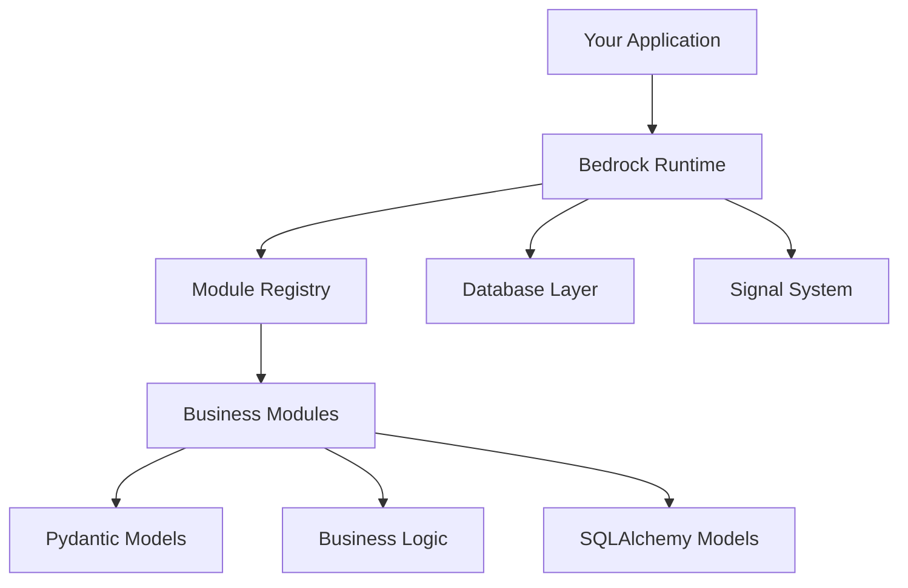

Bedrock is a modular Python application framework designed for teams that want predictable architecture, strong development conventions, and tooling that works well with both humans and AI coding assistants.

## Status

**The core runtime is fully implemented and functional.**

This is not a blueprint or proof-of-concept. Bedrock contains production-ready subsystems:

- Module registry with dependency resolution and lifecycle hooks
- SQLAlchemy 2.0 database layer with Alembic migrations
- Signal/event system (blinker-derived)
- Typer-based CLI for module and database management
- Comprehensive utility library (lazy loading, introspection, string helpers)

## What is Bedrock?

Bedrock provides a **framework-agnostic core runtime** with:

- **Manifest-driven module loading** — Modules declare their identity and dependencies in YAML
- **Lifecycle management** — Hooks for initialization, ready state, and shutdown
- **CLI tools** — Module management, database migrations, and scaffolding

Bedrock is **not** a web framework. It's a modular runtime that works with any Python application type:

- Web applications (FastAPI, Flask, Django)
- Background workers (Celery, RQ)
- CLI tools and scripts
- AI agents and assistants
- Internal tooling

## Core Concepts

### Modules

The fundamental unit of organization in Bedrock. Each module is a self-contained package with its own:

- **Manifest** (`manifest.yaml`) — Identity, version, and dependencies
- **Entities** (`entities.py`) — Business domain entities for internal data flow
- **Schemas** (`schemas.py`) — API input/output contracts (optional)
- **Services** (`service.py`) — Business logic
- **Models** (`models.py`) — Database models (optional)
- **Exceptions** (`exc.py`) — Module-specific errors
- **Bootstrap** (`bootstrap.py`) — Lifecycle hooks

### Registry

The `ModuleRegistry` manages module lifecycle:

1. **Discovery** — Scan for modules with `manifest.yaml`
2. **Validation** — Check dependencies and schema
3. **Ordering** — Compute dependency-respecting load order
4. **Loading** — Import modules in order
5. **Initialization** — Run lifecycle hooks

### Singletons

Bedrock provides key singletons for common operations:

| Singleton | Class | Purpose |
|-----------|-------|---------|
| `bedrock.apps` | `ModuleRegistry` | Module lifecycle |
| `bedrock.db` | `DatabaseManager` | Database operations |

## Architecture



### Layer Boundaries

Bedrock enforces clean layer boundaries:

| Layer | Responsibility | Examples |
|-------|---------------|----------|
| **Data** | Persistence and queries | SQLAlchemy models, database operations |
| **Validation** | Data shape and rules | Pydantic entities, request/response models |
| **Logic** | Business rules | Service classes, domain operations |
| **API** | HTTP interface | FastAPI routers, CLI commands |

**Key rule**: Dependencies flow inward. API depends on Logic, Logic depends on Validation and Data. Never reverse.

## Key Features

### Module System

```python
from bedrock.module.registry import ModuleRegistry

apps = ModuleRegistry()
apps.install("inventory")  # Validates dependencies, loads in order
apps.populate()            # Runs on_load hooks
apps.mark_ready()          # Runs ready hooks
```

### Database Layer

```python
from bedrock.database import db, BedrockModel
import sqlalchemy as sa
from sqlalchemy.orm import mapped_column

class Product(BedrockModel):
    __tablename__ = "products"
    id = mapped_column(sa.Integer, primary_key=True)
    name = mapped_column(sa.String(100), nullable=False)

# Context-local session management
product = Product(name="Widget")
db.session.add(product)
db.session.commit()

# New session
with db.session_factory() as session:
    product = session.query(Product).filter_by(name="Widget").first()
```


### Signal System

```python
from bedrock.signal import Signal

user_created = Signal("user_created")

@user_created.connect
def on_user_created(sender, user):
    print(f"User created: {user.name}")

user_created.send(current_app, user=new_user)
```

## CLI Commands

Bedrock provides CLI tools for common operations:

```bash
# Module management
bedrock app inspect <module>   # Validate manifest
bedrock app info <module>      # Display module details
bedrock app install <module>   # Run migrations and hooks

# Database migrations
bedrock db revision --message "description"
bedrock db upgrade
bedrock db history

# Run module commands
bedrock run <module> <command>
```

## Project Goals

1. Provide a standalone modular runtime for Python applications
2. Support Django/Odoo-like module loading with explicit dependency management
3. Offer first-party `contrib` modules for common capabilities
4. Stay adaptable to FastAPI without coupling the core runtime to HTTP concerns
5. Enforce a predictable module structure that supports clean architecture
6. Provide CLI tools that generate and validate Bedrock-style application structure

## Next Steps

- [Installation](/docs/getting-started/installation) — Install Bedrock
