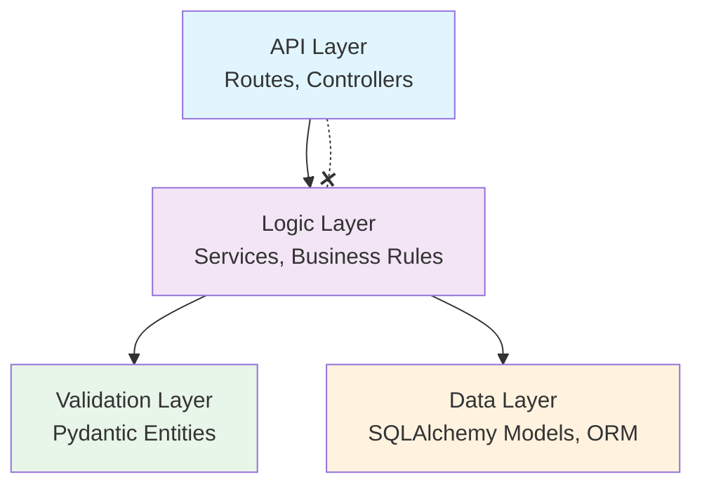

Bedrock is designed around a strict layered architecture that separates concerns and keeps the core framework-agnostic.

## Core Architectural Principles

### 1. Framework-agnostic core

Bedrock should not require FastAPI in its core module system.
FastAPI support belongs in an adapter layer.

### 2. Explicit modularity

Modules should declare their identity and dependencies in `manifest.yaml`.
The runtime should not depend on import-time side effects to understand module relationships.

### 3. Clean layer boundaries

Bedrock modules should favor a layered structure such as:

- `models.py` — Data models and persistence
- `entities.py` — Business entities
- `service.py` — Business logic layer
- `exc.py` — Module-specific exceptions

Not every module must implement every file, but this is the default Bedrock vocabulary.

### 4. Predictable conventions

A strict structure helps developers move faster and makes AI-generated code more accurate because the architecture is not ambiguous.

## Package Responsibilities

### `bedrock`

The core runtime package is responsible for:

- manifest parsing
- module discovery
- dependency graph validation
- deterministic load ordering
- lifecycle orchestration
- optional framework adapters

### `bedrock-cli` (Planned)

> **Note:** `bedrock-cli` is a planned standalone package. The current CLI lives embedded within the `bedrock` core package at `bedrock.cli`.

The CLI package will be responsible for:

- workspace initialization
- module scaffolding
- CRUD/code generation helpers
- manifest validation
- dependency graph inspection
- future project health checks

## FastAPI Support

FastAPI is an important target integration, but not the center of the design.

The intended rule is:

- core runtime handles modules and lifecycle
- FastAPI adapter handles router collection and mounting
- service-layer code stays free of HTTP request/response objects

This allows Bedrock to support:

- FastAPI applications
- background jobs
- scripts
- non-API services
- internal tooling

## Layer Boundary Diagram

The following diagram illustrates the strict separation between layers in a Bedrock application:

Key constraints:

- **API → Logic**: API layer calls services, never the reverse
- **Logic → Data**: Services access persistence through models only
- **Logic → Validation**: Services use Pydantic entities for input/output contracts
- **No HTTP in Logic**: Service functions never accept `Request` or `Response` objects
- **No ORM in API**: Controllers never interact with SQLAlchemy sessions directly

## Data Flow

A typical request flows through the layers in a predictable sequence:

1. **Inbound** — An HTTP request (or CLI command, background task trigger) arrives at the API layer
2. **Validation** — The adapter deserializes the payload into a Pydantic entity, rejecting malformed input early
3. **Dispatch** — The API layer calls the appropriate service function, passing validated entities
4. **Business Logic** — The service layer orchestrates operations: queries the data layer, applies rules, emits signals
5. **Persistence** — The data layer executes ORM operations within a managed session
6. **Response** — Results flow back up: the service returns entities, the API layer serializes them for the transport

Because the service layer is framework-agnostic, the same business logic works whether called from a FastAPI route, a Celery task, or a CLI command.

## Singleton Lifecycle

Bedrock uses three key singletons that follow a deliberate initialization order:

| Singleton | Class | Initialized by |
|-----------|-------|----------------|
| `apps` | `ModuleRegistry` | Instantiated at import time (empty). Populated via `apps.populate()` or `bedrock.setup()` |
| `db` | `DatabaseManager` | Instantiated at import time (unconfigured). Requires explicit `db.init(url)` before use |
| `cache` | `CacheService` | Instantiated at import time (no backend). Auto-configures on first access, or call `cache.configure(backend)` |

### Initialization sequence

1. **Import time** — All three singletons exist but are inert (no connections, no state)
2. **`bedrock.setup()`** — Calls `apps.populate(module_list)`, which installs modules and fires `on_load` hooks
3. **Module `on_load` hooks** — Modules that need the database call `db.init()` during their `on_load` phase
4. **`apps.mark_ready()`** — Fires `ready` hooks on all modules, then emits `registry_ready` signal
5. **First cache access** — If not explicitly configured, the cache auto-initializes with the `memory` backend

### Shutdown

Shutdown runs in reverse install order: each module's `on_shutdown` hook is called, then `registry_shutdown` is emitted. Modules should close connections and release resources during this phase.

## When to Use Each Layer

| Question | Layer | Example |
|----------|-------|---------|
| "Where do I validate user input?" | **Validation** (`entities.py`) | Pydantic model with field constraints |
| "Where do I define database tables?" | **Data** (`models.py`) | SQLAlchemy declarative models |
| "Where do I put business rules?" | **Logic** (`service.py`) | Functions that orchestrate operations |
| "Where do I handle HTTP specifics?" | **API** (adapter/routes) | FastAPI route handlers |
| "Where do I define module exceptions?" | **Logic** (`exc.py`) | Subclasses of `BedrockExc` |
| "Where do I run startup code?" | **Lifecycle** (`bootstrap.py`) | `on_load` / `ready` hooks |

### Decision rules

- If it touches `Request`, `Response`, or HTTP status codes → **API layer**
- If it imports `sqlalchemy` → **Data layer**
- If it imports `pydantic` for input/output shapes → **Validation layer**
- If it contains conditional logic, calculations, or orchestration → **Logic layer**
- If it runs once at startup → **Lifecycle hooks** in `bootstrap.py`

