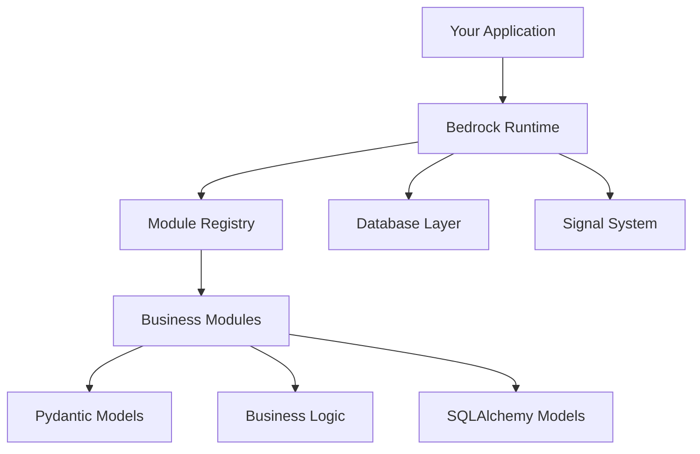

Bedrock 是一个模块化 Python 应用框架，适合希望拥有可预测架构、强开发约定，以及能够与人类和 AI 编码助手良好协作工具链的团队。

## 状态

**核心运行时已完整实现并可正常使用。**

这不是蓝图，也不是概念验证。Bedrock 已包含可用于生产的子系统：

- 带依赖解析和生命周期钩子的模块注册表
- 基于 SQLAlchemy 2.0 和 Alembic migrations 的数据库层
- 信号/事件系统（衍生自 blinker）
- 基于 Typer 的 CLI，用于模块和数据库管理
- 完整的工具库（延迟加载、内省、字符串辅助工具）

## 什么是 Bedrock？

Bedrock 提供了一个**与框架无关的核心运行时**，具备：

- **由 Manifest 驱动的模块加载** —— 模块使用 YAML 声明自身标识和依赖
- **生命周期管理** —— 提供初始化、就绪状态和关闭阶段的钩子
- **CLI 工具** —— 用于模块管理、数据库迁移和脚手架生成

Bedrock **不是** Web 框架。它是一个模块化运行时，适用于各种 Python 应用类型：

- Web 应用（FastAPI、Flask、Django）
- 后台工作进程（Celery、RQ）
- CLI 工具和脚本
- AI agents 和 assistants
- 内部工具

## 核心概念

### 模块

在 Bedrock 中，模块是最基本的组织单元。每个模块都是一个自包含包，拥有自己的：

- **Manifest** (`manifest.yaml`) —— 标识、版本与依赖
- **Entities** (`entities.py`) —— 用于校验的 Pydantic 模型
- **Services** (`service.py`) —— 业务逻辑
- **Models** (`models.py`) —— 数据库模型（可选）
- **Exceptions** (`exc.py`) —— 模块专用错误
- **Bootstrap** (`bootstrap.py`) —— 生命周期钩子

### 注册表

`ModuleRegistry` 负责管理模块生命周期：

1. **发现** —— 扫描带有 `manifest.yaml` 的模块
2. **校验** —— 检查依赖和 schema
3. **排序** —— 计算满足依赖关系的加载顺序
4. **加载** —— 按顺序导入模块
5. **初始化** —— 运行生命周期钩子

### 单例

Bedrock 为常见操作提供了几个关键单例：

| 单例 | 类 | 用途 |
|-----------|-------|---------|
| `bedrock.apps` | `ModuleRegistry` | 模块生命周期 |
| `bedrock.db` | `DatabaseManager` | 数据库操作 |

## 架构



### 层边界

Bedrock 强制保持清晰的层边界：

| 层 | 职责 | 示例 |
|-------|---------------|----------|
| **Data** | 持久化与查询 | SQLAlchemy models、database operations |
| **Validation** | 数据结构与规则 | Pydantic entities、request/response models |
| **Logic** | 业务规则 | Service classes、domain operations |
| **API** | HTTP 接口 | FastAPI routers、CLI commands |

**关键规则**：依赖只能向内流动。API 依赖 Logic，Logic 依赖 Validation 和 Data。绝不能反向依赖。

## 关键特性

### 模块系统

```python
from bedrock.module.registry import ModuleRegistry

apps = ModuleRegistry()
apps.install("inventory")  # Validates dependencies, loads in order
apps.populate()            # Runs on_load hooks
apps.mark_ready()          # Runs ready hooks
```

### 数据库层

```python
from bedrock.database import db, BedrockModel
import sqlalchemy as sa
from sqlalchemy.orm import mapped_column

class Product(BedrockModel):
    __tablename__ = "products"
    id = mapped_column(sa.Integer, primary_key=True)
    name = mapped_column(sa.String(100), nullable=False)

# Context-local session management
product = Product(name="Widget")
db.session.add(product)
db.session.commit()

# New session
with db.session_factory() as session:
    product = session.query(Product).filter_by(name="Widget").first()
```


### 信号系统

```python
from bedrock.signal import Signal

user_created = Signal("user_created")

@user_created.connect
def on_user_created(sender, user):
    print(f"User created: {user.name}")

user_created.send(current_app, user=new_user)
```

## CLI 命令

Bedrock 为常见操作提供了 CLI 工具：

```bash
# Module management
bedrock app inspect <module>   # Validate manifest
bedrock app info <module>      # Display module details
bedrock app install <module>   # Run migrations and hooks

# Database migrations
bedrock db revision --message "description"
bedrock db upgrade
bedrock db history

# Run module commands
bedrock run <module> <command>
```

## 项目目标

1. 为 Python 应用提供独立的模块化运行时
2. 支持类似 Django/Odoo 的模块加载机制，并具备显式依赖管理
3. 为常见能力提供官方 `contrib` 模块
4. 在不让核心运行时耦合 HTTP 关注点的前提下保持对 FastAPI 的适配性
5. 强制执行可预测的模块结构，以支持 clean architecture
6. 提供 CLI 工具，用于生成和校验符合 Bedrock 风格的应用结构

## 下一步

- [安装](/docs/getting-started/installation) —— 安装 Bedrock
